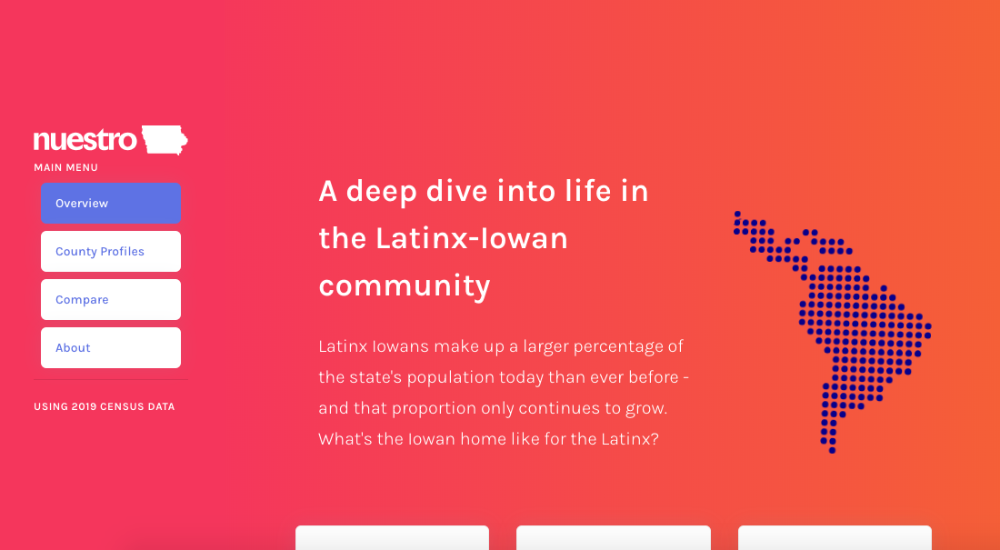
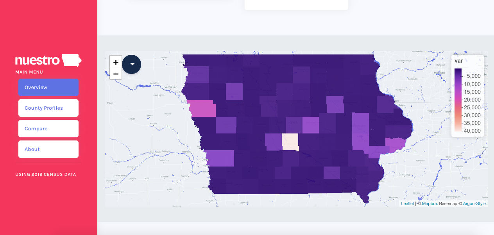
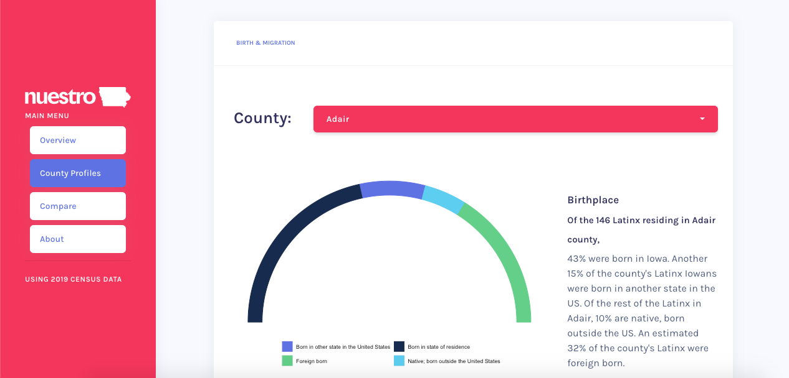

# Background

This repo contains code for running the *Nuestro Iowa* project dashboard created for [Al Exito](www.alexitoiowa.org). The dashboard uses argonDash, which implements [Creative Tim's Argon framework](https://www.creative-tim.com/product/argon-design-system).

# App

